# Dinametra Test App

Esta es una prueba técnica para Dinametra, utilizando React + Typescript. En ella se desarrolla una aplicación web para la visualización datos sobre Asteroides obtenidos de la API de la NASA, los cuales son graficados gracias a la librería ChartJS.


## Tecnologias Utilizadas

* ReactJS v18.2.0
* Jest v29.7.0
* React Testing Library v16.0.0
* Vite v5.2.0
* chart.js v4.4.3
* react-chartjs-2 v5.2.0
## Instalación y Configuración

Instalar con los siguientes comandos:

```bash
  git clone https://github.com/Leo-IES/dinametra-testapp.git
  cd dinametra-testapp
  npm install
  npm run dev
```
* No se requieren pasos extra.

    
## Ejecución de Pruebas Unitarias
Ejecutar con el comando:
```bash
  npm test
```
## Enfoque Adoptado

Me decante por trabajar con ReactJS + Typescript debido al alcance del proyecto, siendo una única página apreciable, las capacidades de modularización y reutilización de componentes que ofrece React son adecuadas. Siendo una librería de fácil escalabilidad da posibilidades de expansiones futuras sin mucha complicación. Por el lado de Typescript me parece una gran opción al momento de un desarrollo más estructurado puesto que nos habilita el tipado de datos en Javascript, lo que nos ayuda a tener un control sobre los datos que son enviados y manejados desde nuestra aplicación.

Para los estilos de los componentes preferí utilizar CSS puro sin librerías externas para apreciar el control sobre esta tecnología. Se pensó en un estilo limpio y simple de Cards que se acomodaban según la resolución del dispositivo. Esto con el fin de ser intuitivo y de fácil entendimiento para cualquier usuario. Así mismo cuenta con Tooltips y leyendas que sirven de Guía para poder apreciar correctamente los datos desplegados por la librería de ChartJS, esta última siendo una librería que nos brinda la posibilidad de mostrar graficas de forma ordenada y fácil. La información desplegada fue la obtenida de la API libre de NASA API's.


## Suposiciones Realizadas

Me enfoque en hacer una aplicación sencilla y muy intuitiva para el despliegue rápido de información. Esta misma información puede ser filtrada por dos rasgos: "Por Nombre" y "Por Fecha". En el caso del "Filtro por Fecha" se hizo de la mano de las posibilidades que nos brinda la API al mandar una fecha específica y te retorna la información correspondiente. Por otro lado, el "Filtro por Nombre" se hizo localmente de la mano de un proceso de Filter al Array de información obtenido. De tal forma que se demuestre el manejo de filtros en condiciones diferentes.

Las pruebas unitarias fueron realizadas principalmente en la MainPage debido a que era el flujo central del comportamiento de la aplicación, a la vez que se enfocaron en probar el correcto despliegue de la información en la vista así como el de los filtros.

## Capturas de Pantalla

### Pantalla Inicial - Loading
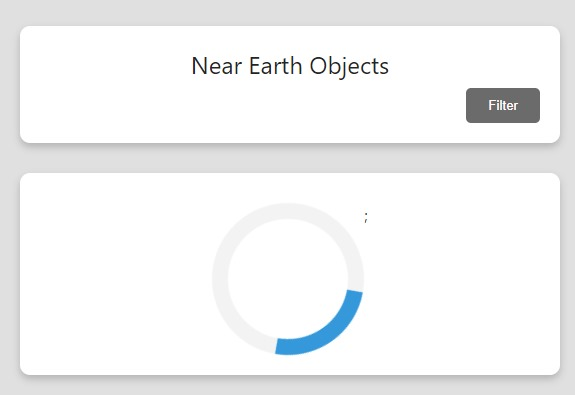

### Pantalla Inicial
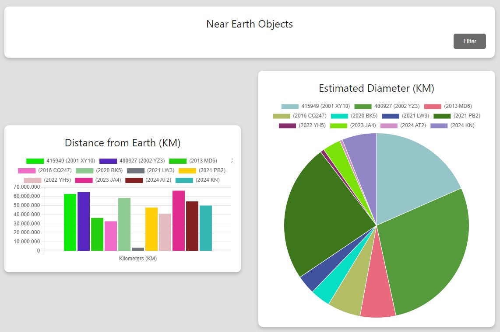

### Pantalla Inicial - Filtro
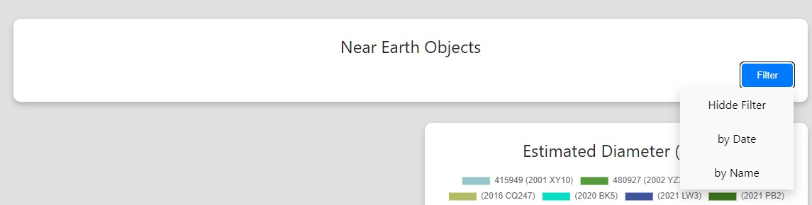

### Pantalla Inicial - Filtro por Nombre
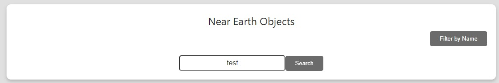

### Pantalla Inicial - Filtro por Nombre Aplicado
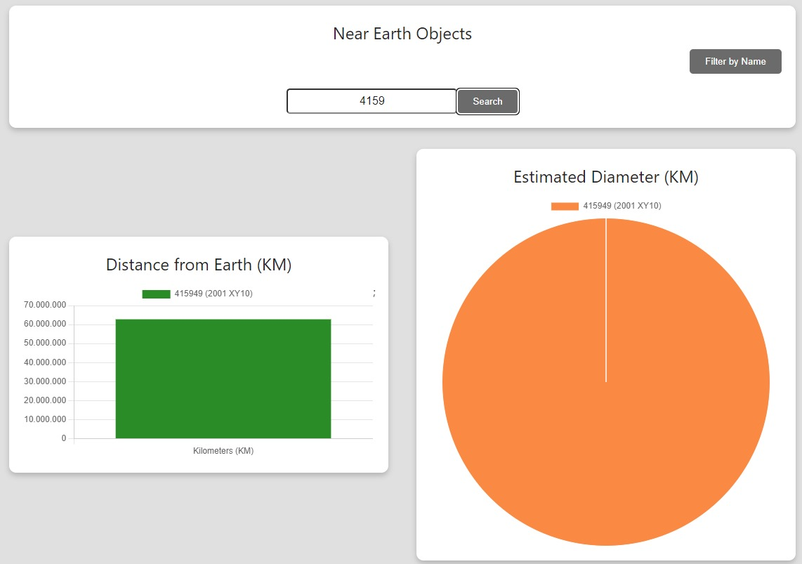

### Pantalla Inicial - Filtro por Fecha
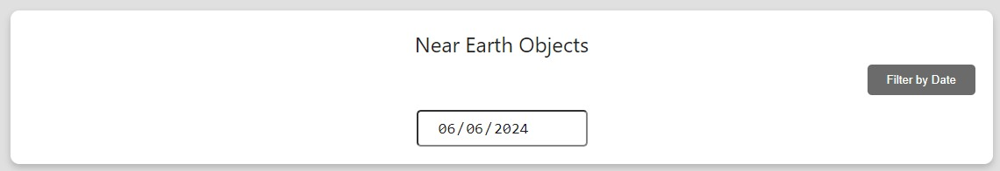

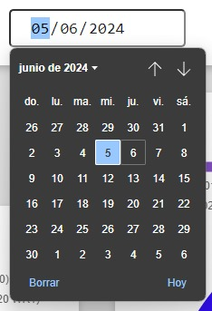

### Pantalla Inicial - Filtro por Fecha Aplicado
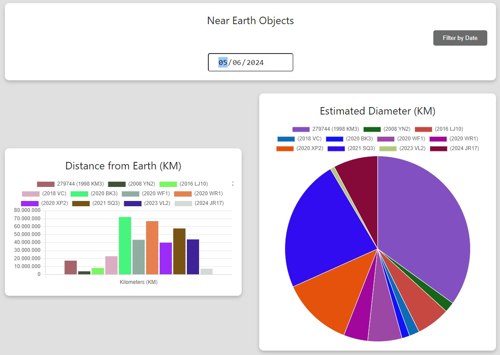

### Pantalla Inicial - Tooltip
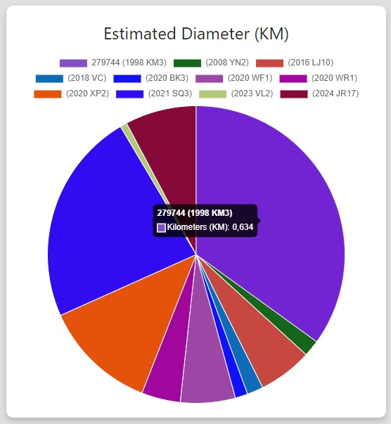

### Pantalla Inicial - Tooltip 2
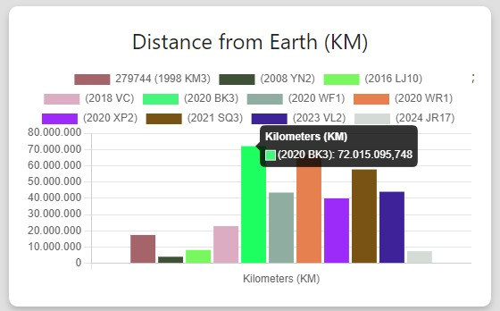

### Pantalla Inicial - Responsive iPhone SE Vertical (365 x 667 px)
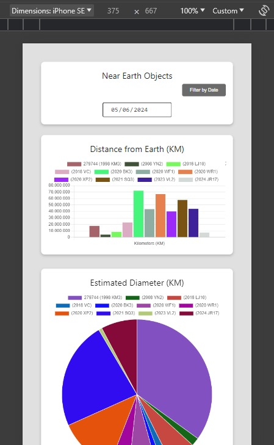

### Pantalla Inicial - Responsive iPhone SE Horizontal (667 x 365 px)
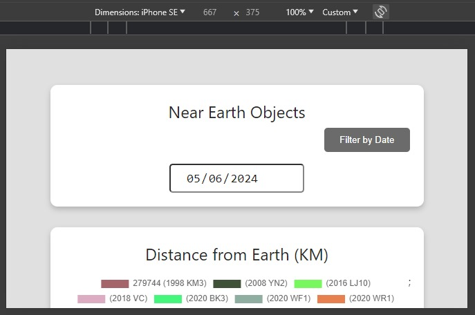

### Pantalla Inicial - Responsive iPad Pro Vertical (1024 x 1336 px)
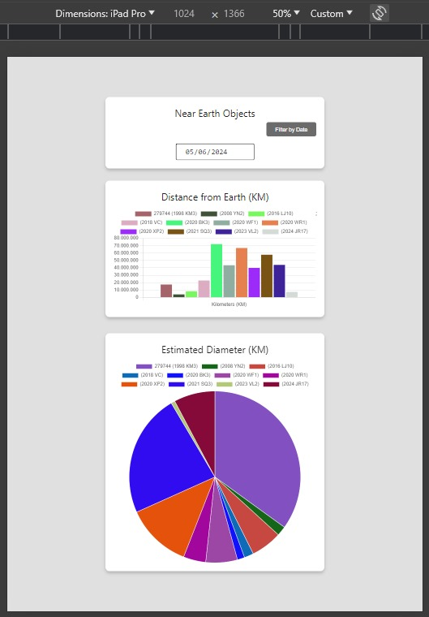

### Pantalla Inicial - Responsive iPad Pro Horizontal (1336 x 1024 px)
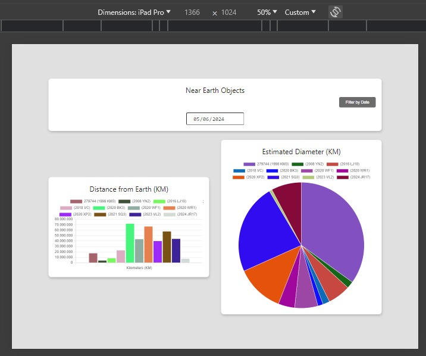